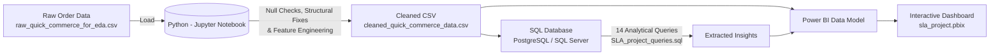

# 🛵 Quick Commerce Operations Analytics & SLA Analysis
### *An End-to-End Data Analytics Project — Python • SQL • Power BI*


> A complete operational analytics pipeline — from messy raw data to an interactive Power BI dashboard, uncovering the hidden drivers of **SLA delivery breaches, profitability leaks, and marketing inefficiencies in a Quick Commerce platform.**

---

## 📌 Table of Contents
- [Problem Statement](#-problem-statement)
- [Power BI Dashboard Preview](#-power-bi-dashboard-preview)
- [Project Architecture](#-project-architecture)
- [Tech Stack](#-tech-stack)
- [Dataset](#-dataset)
- [Project Workflow](#-project-workflow)
- [Key Business Insights](#-key-business-insights)
- [Repository Structure](#-repository-structure)
- [How to Reproduce This Project](#-how-to-reproduce-this-project)
- [Results & Recommendations](#-results--recommendations)

---

## 🎯 Problem Statement

A growing Quick Commerce delivery platform wants to understand the operational bottlenecks affecting their bottom line. Leadership needs answers to:

1. **How frequently are deliveries breaching SLAs (Service Level Agreements), and what is the impact on customer satisfaction?**
2. **Which stores and time periods are struggling the most with operations and profitability?**
3. **What is the true ROI (Return on Ad Spend) across various marketing campaigns and channels?**

This project provides an end-to-end analytical solution: thoroughly cleaning raw, messy data in **Python**, running structured operational queries in **SQL**, and visualizing KPIs and trends via an interactive **Power BI** dashboard.

---

## 📊 Power BI Dashboard Preview

*(Visualizing operations, profitability, and customer sentiment)*

### [Executive Overview]


### [Operations & SLA]


### [Customer & Marketing]


---

## 🏗 Project Architecture



**The flow in plain English:**
`Raw Data → Python Cleaning & EDA → SQL Querying & Views → Power BI Model → Interactive Dashboard Insights`

---

## 🛠 Tech Stack

| Layer | Tool | Purpose |
|---|---|---|
| **Data Cleaning & EDA** | Python (`pandas`, `numpy`, `seaborn`) | Structural diagnostics, null handling, duplicate removal, feature engineering |
| **Database / Analysis** | SQL (PostgreSQL / SQL Server) | Cross-referencing tables, advanced aggregations (CTEs, Window functions) |
| **BI & Visualization** | Power BI Desktop | Data modeling, DAX measures, interactive dashboards |

---

## 🗂 Dataset

The dataset contains **13,000+ quick-commerce orders** spanning multiple stores, campaigns, and customer profiles.

**Key attribute groups:**
- 👤 **Customer & Feedback:** Customer ID, Segment (Gold, Regular, Inactive), Rating (1-5), Sentiment, Feedback Category
- 🛵 **Operations & SLA:** Order Date, Promised Delivery Time, Actual Delivery Time, Delivery Status, SLA Breach Flag, Delay Minutes
- 💰 **Financials:** Order Total, Unit Price, Profit, Profit Margin
- 📈 **Marketing:** Campaign Name, Channel, Impressions, Spend, Revenue Generated, ROAS

---

## 🔄 Project Workflow

### 1️⃣ Data Cleaning & EDA — *Python (Jupyter Notebook)*
- Ingested raw datasets with unresolved structural issues (duplicate ID columns, corrupted store IDs).
- Performed rigorous data quality checks: missing value imputation, resolving invalid numeric sentinels (e.g., ratings out of bounds), and filtering statistical outliers.
- Engineered features such as `delay_minutes`, `sla_breach`, `profit_margin`, and `peak_period` to set up downstream analysis.
- Validated distributions and outputted a clean, production-ready dataset (`cleaned_quick_commerce_data.csv`).

### 2️⃣ Advanced Analysis — *SQL*
- Defined the schema and loaded the cleaned data into a relational database.
- Developed 14 complex queries using Window Functions and CTEs to extract actionable insights.
- Answered crucial business questions spanning Operations, Profitability, and Marketing.

### 3️⃣ Data Modeling & Visualization — *Power BI*
- Built a 3-page interactive report connecting the cleaned data layer to business metrics.
- Authored dynamic DAX measures to track KPIs like Total Orders, Average Order Value (AOV), Profit Margin, and Overall SLA Breach Rate.
- Standardized axes and mitigated visualization artifacts to ensure absolute accuracy in data storytelling.

---

## 🔍 Key Business Insights

> *(Derived directly from the analytical pipeline — these findings power the business recommendations)*

- 📉 **Delays Kill Satisfaction:** Severely delayed deliveries drop customer ratings by **~52% (4.40★ → 2.11★)** and positive sentiment by **~80 percentage points (90% → 9.6%)**, quantifying the direct link between delivery SLA and customer churn risk.
- 🌙 **The Night-Shift Problem:** "Night" period deliveries breach SLA at **~3x the rate** of other periods (29.6% vs ~10%), despite representing only 11% of order volume. This indicates a targeted staffing/logistics bottleneck rather than a company-wide failure.
- 🏪 **Store Diagnostics:** By cross-referencing store-level profit and SLA data, we can distinguish between *overloaded-but-profitable* stores and *structurally underperforming* ones, isolating specific stores needing immediate operational intervention.
- 📱 **Marketing Efficiency:** Instagram and YouTube delivered **4.2–4.4x ROAS** despite lower order volumes than higher-spend channels like Social Media — providing a clear opportunity to reallocate marketing spend.

---

## 📁 Repository Structure

```text
Quick-Commerce-SLA-Analytics/
│
├── README.md                                  # You are here
├── raw_quick_commerce_for_eda.csv             # Raw source data
├── cleaned_quick_commerce_data.csv            # Cleaned data ready for SQL/BI
│
├── Quick Commerce Operations Analytics.ipynb  # Python notebook (Cleaning & EDA)
├── SLA_project_queries.sql                    # SQL queries for analysis
│
├── sla_project - Copy.pbix                    # Power BI dashboard (3 pages)
└── dashboard-screenshots/                     # Exported dashboard screenshots
    ├── executive_overview_page01.png
    ├── delivery_operations_page02.png
    └── customer_marketing_page03.png
```

---

## ⚙️ How to Reproduce This Project

1. **Python Data Cleaning:**
   - Open `Quick Commerce Operations Analytics.ipynb` in Jupyter.
   - Run all cells to process `raw_quick_commerce_for_eda.csv` and generate the cleaned outputs.
2. **SQL Analysis:**
   - Import `cleaned_quick_commerce_data.csv` into your SQL database (PostgreSQL/MySQL).
   - Execute the schema and queries provided in `SLA_project_queries.sql`.
3. **Power BI Dashboard:**
   - Open `sla_project - Copy.pbix`.
   - Update the Data Source settings to point to your local path of `cleaned_quick_commerce_data.csv`.
   - Refresh the model to interact with the visualizations.

---

## ✅ Results & Recommendations

| Finding | Recommended Action |
|---|---|
| **Night SLA Breaches** | Increase rider allocation or optimize batching algorithms specifically for the Night shift (low cost, high impact). |
| **Delay Impact on Ratings** | Implement proactive "Sorry we're late" automated discounts when a delivery breaches SLA by >15 minutes to save customer sentiment. |
| **High ROAS on IG/YouTube** | Shift 15-20% of ad spend away from general Social Media into Instagram and YouTube to maximize ROI. |
| **Store Underperformance** | Launch targeted audits on the Bottom 5 stores by SLA breach rate to determine if the issue is inventory layout, rider availability, or poor management. |

---
